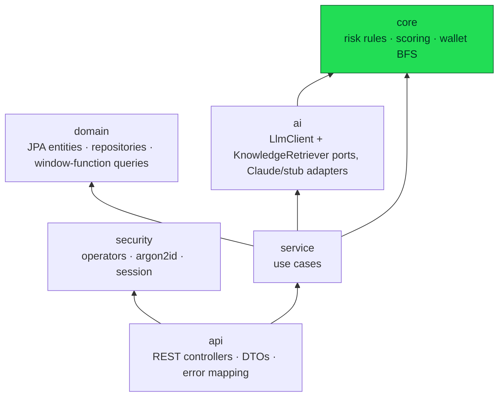

# Architecture

## The pyramid

```
core/     PURE JAVA. No Spring, no JPA, no SQL, no HTTP. Imports nothing framework-shaped.
domain/   JPA entities, repositories, window-function queries.
ai/       LlmClient + Retriever ports. Claude and stub adapters.
security/ Operators, argon2id, session.
service/  Use cases.
api/      REST controllers, DTOs, error mapping.
```

Six packages under `ch.gotthard`, and dependencies point strictly downward.
`core` and `domain` sit at the bottom, as siblings that don't know about each
other; `ai` and `security` sit above `core`; `service` orchestrates all of
them into use cases; `api` is the thin REST layer on top. This isn't
described in a design doc that can drift from the code — it's enforced by
`ArchitectureTest`, an ArchUnit suite that fails the build the moment a
dependency points the wrong way.



## Why the core is pure Java

`core/` imports nothing framework-shaped: no `org.springframework`, no
`jakarta.persistence`, no `org.hibernate`, no `java.sql`. That buys two things
directly, and one thing indirectly.

- **Every rule test runs with no Spring context and no database.** A rule is a
  class implementing `Rule` — `code()`, `appliesTo()`, `fires(Features)`, and
  an optional `contribution()` — reading a `Features` record that has already
  been assembled. Testing whether `CardNotPresentDeclineClusterRule` fires is
  constructing a `Features` and calling a method; nothing to spin up, nothing
  to seed, nothing that makes the test suite slow enough that people stop
  running it.
- **The scorer never needs to change.** `RiskScorer` iterates a `List<Rule>`,
  filters by `appliesTo()`, calls `fires()`, prices what fires through
  `RuleWeights`, and sums. It has no `if (rule instanceof SomeSpecificRule)`
  anywhere — it cannot, because it doesn't import any concrete rule. Adding an
  eighth rule is a new class implementing `Rule`, a line in
  `StandardRules.all()`, and a new `risk_rules` row. `RiskScorer.java` is not
  in the diff.
- Indirectly: a decision engine a bank relies on being reproducible is easier
  to audit when it cannot reach a database, a clock via I/O, or a network call
  by construction, not by convention. The core's purity is a property the
  compiler checks, not a promise in a comment.

`ArchitectureTest` states this as four rules, and states exactly why each one
exists:

| Rule | What it forbids |
|---|---|
| `core_depends_on_no_framework` | Nothing in `..core..` may depend on `org.springframework..`, `jakarta.persistence..`, `org.hibernate..`, `java.sql..` or `javax.sql..` — "the core engine must unit-test with no context, no database and no HTTP." |
| `core_depends_on_nothing_above_it` | Nothing in `..core..` may depend on `..api..`, `..service..`, `..domain..`, `..ai..` or `..security..` — "the foundation of the pyramid cannot rest on its higher layers." |
| `controllers_go_through_services` | Nothing in `..api..` may depend on `..domain..` — "the web layer talks to use cases, never to repositories directly." |
| `domain_does_not_know_about_the_web` | Nothing in `..domain..` may depend on `..api..` or `..service..` — "persistence is a lower layer than the use cases that call it." |

Each carries `allowEmptyShould(true)` only because ArchUnit fails a rule that
matches zero classes — a concession to a repository being built up
incrementally, not permission for a layer to stay empty. If one of these
fails, the fix is always in the code that introduced the upward dependency,
never in relaxing the rule.

## The flow of one analysis

Running an analysis for a customer is `AiAnalysisService.analyse(...)`
composing five stages, each owned by a different layer:

```mermaid
flowchart LR
    subgraph PostgreSQL
        FWQ["FeatureWindowQuery<br/>RANGE window functions"]
    end
    subgraph core [core — pure Java]
        FA["FeatureAssembler"]
        FT["Features"]
        RS["RiskScorer + Rule×7"]
        RE["RiskEvaluation"]
    end
    subgraph service
        RES["RiskEvaluationService<br/>writes risk_assessments"]
    end
    subgraph ai [ai — retrieval + LLM ports]
        KR["KnowledgeRetriever<br/>pgvector cosine similarity"]
        LLM["LlmClient<br/>Claude or stub"]
    end
    subgraph persisted
        AA["ai_analyses +<br/>ai_analysis_citations"]
    end

    FWQ -->|FeatureRow| FA --> FT --> RS --> RE --> RES
    RES -->|fired rule codes| KR -->|RetrievedChunk policy text| LLM
    RES -->|score + findings| LLM
    LLM -->|LlmCompletion: verdict, tokens, latency| AA
```



1. **Window functions compute features.** `FeatureWindowQuery` runs a single
   SQL statement per evaluation — one CTE chain of rolling `RANGE` frames over
   the customer's whole timeline — producing one `FeatureRow` per transaction
   in the requested window, each already carrying velocity, corridor and
   card-cluster aggregates. See [Risk Model](risk-model.md) for what those
   frames compute and why `RANGE` rather than `ROWS` is load-bearing here.
2. **`FeatureAssembler` translates.** This is the one class that speaks both
   vocabularies: SQL strings, epoch seconds and nulls on one side; `Features`,
   `Duration`, `Money` and honest sentinel values (`CryptoSignals`'s
   `NO_INBOUND_FUNDING`, `NO_PATH_TO_FLAGGED_WALLET`) on the other. Once a row
   crosses this seam the core never sees SQL again.
3. **The core scores it.** `RiskScorer.score(features, weights)` runs every
   rule whose `appliesTo()` matches the transaction's channel, keeps the ones
   that `fires()`, prices each with `contribution()` (the weight, by default —
   `FlaggedWalletProximityRule` is the one exception, see below), and totals
   into a `RiskEvaluation`.
4. **`RiskEvaluationService` writes the audit trail.** Every `RuleHit` becomes
   a `risk_assessments` row — idempotently, so refreshing the screen doesn't
   duplicate a finding already recorded for that transaction — before the
   fired rule codes go anywhere near retrieval or the model.
5. **Retrieval is grounded in what fired, not in what's asked.**
   `KnowledgeRetriever` never sees operator free text. For each fired rule
   code, `PgVectorKnowledgeRetriever` embeds that rule's canonical phrase from
   `RuleQueryVocabulary`, runs a separate pgvector nearest-neighbour search
   against `policy_chunks`, and merges the results keeping each chunk's
   highest similarity across every rule query that surfaced it — so a
   transaction that fires two unrelated rules grounds its write-up in policy
   for both, rather than whichever topic a single blended query happened to
   favour.
6. **The model explains, never decides.** `AiAnalysisService` assembles an
   `AnalysisRequest` from the score, the activity, each fired rule's own
   `threshold_logic` sentence, and the retrieved policy, and hands it to
   `LlmClient`. `AnthropicLlmClient` asks Claude for structured output
   (`AnalysisVerdict` as a JSON schema, no prose parser) with adaptive
   thinking and a cached system prompt; `StubLlmClient` produces the same
   shape deterministically offline. Either way, the returned `LlmCompletion`
   carries its own provenance — token counts, latency, provider, prompt
   version — because those are exactly the questions asked of an audit record
   six months later.
7. **Both verdicts persist, separately.** `AiAnalysisArchive` writes
   `computed_level` (the rules) and `assessed_level` (the model) into
   different columns of `ai_analyses`, with `levels_diverged` as a `GENERATED`
   column over the two. Nothing downstream lets one overwrite the other.

`AiAnalysisService` is deliberately not `@Transactional` end to end: a Claude
call takes seconds, and holding a database connection open across it for no
reason is how a connection pool gets exhausted by a feature nobody's even
using yet. The rules write their audit trail in their own transaction; the
archive writes the analysis in its own; the slow part happens between them,
holding nothing.

## The wallet graph — the one signal that isn't a window function

`FeatureWindowQuery`'s `RANGE` frames handle velocity, corridors and card
clusters, but "how many hops from a flagged address" isn't an aggregate over a
timeline — it's a walk of a graph, and it lives in `core/graph`:

- **`WalletGraphQuery`** (`domain`) loads the whole edge set — distinct
  `(wallet_address_from, wallet_address_to)` pairs from `crypto_activity` — as
  plain `WalletEdgeRow`s. No algorithm here, just a `SELECT DISTINCT`.
- **`WalletGraph`** (`core`) indexes those edges by sender once, so a lookup
  is a map access rather than a scan.
- **`FlaggedWalletSearch`** (`core`) runs a breadth-first search one frontier
  at a time from the source wallet, checking the watch list *before* the
  first hop — so a wallet already flagged costs nothing to detect and reads
  as zero hops — then expanding outward, capped at `maxDepth`. The cap bounds
  frontier expansion itself, so an address one hop beyond the limit is exactly
  as invisible as one that's unreachable; both collapse to the same
  `CryptoSignals.NO_PATH_TO_FLAGGED_WALLET` sentinel, and the rule reading it
  never has to know which case happened.
- **`WalletProximityLoader`** (`service`) is the seam: it loads the current
  edge set and the configured watch list once per evaluation (not once per
  transaction), builds the graph, and hands `FeatureAssembler` a
  `WalletProximity` port. `FlaggedWallets` is empty by default — an
  unconfigured watch list is a true statement, not a bug, and the proximity
  rule simply stays inert until one is set.

See [Risk Model](risk-model.md) for how `R-05` turns a hop count into a
score.

## The REST surface

`api/` is deliberately thin — three controllers, each translating HTTP onto a
service call and nothing more (`controllers_go_through_services` is what
keeps it that way):

| Controller | Endpoints |
|---|---|
| `AuthController` | `GET /api/auth/csrf`, `POST /api/auth/login`, `GET /api/auth/me` |
| `CustomerController` | `GET /api/customers/{idOrReference}`, `GET /api/customers/{customerId}/activity`, `GET /api/customers/{customerId}/risk` |
| `AnalysisController` | `POST /api/customers/{customerId}/analysis`, `GET /api/customers/{customerId}/analyses`, `GET /api/analyses/{analysisId}` |

`ApiExceptionHandler` maps the use-case exceptions each service throws
(`CustomerNotFoundException`, `AiAnalysisUnavailableException`, …) onto HTTP
status codes in one place, so a controller method is a call into `service/`
and a response, not a `try`/`catch`.
